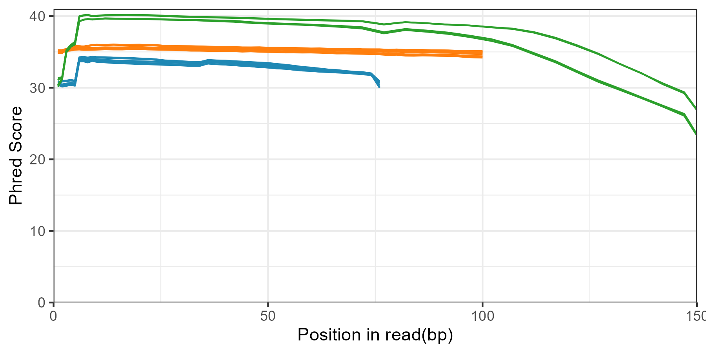
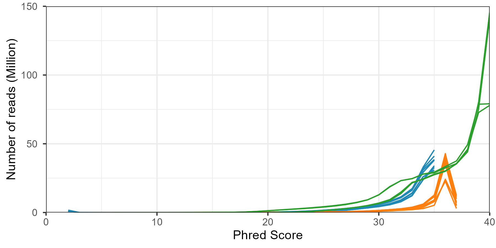
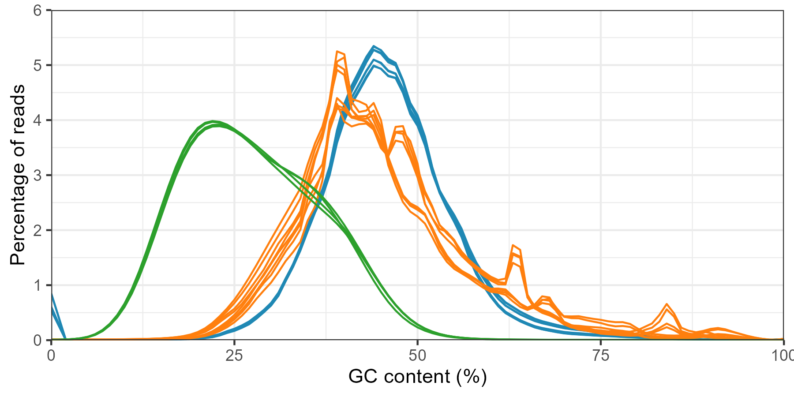

# Quality control
> The file records all quality control performed during the selection of datasets.

* [Package version](#package-version)
* [Employed dataset](#employed-dataset)
  + [Results](#results)
* [Queried dataset](#queried-dataset)
* [Reference](#reference)

## Package version
`fastqc v0.11.9`
`multiqc v1.14`
`hisat2 v2.2.1`

## Employed dataset

The following figure shows the quality of all fastq file that were incoporated during the study. This study includes RNA-seq, ATAC-seq and WGBS for 0 hour (untreat) and 24 hour 100ng/ml (~162nM) PMA treated THP-1 cells. The dataset are recorded under PRJNA533829 / GSE130096.

| Accession Number | Technique | Condition | Number of Reads (Million) |
| ------------------ | ------------------: | ------------------: | ----------------: |
| SRR8932925 | ATAC | 0 hour | 134.2 |
| SRR8932926 | ATAC | 24 hour | 128.2 |
| SRR8932927 | ATAC | 0 hour | 101.5 |
| SRR8932928 | ATAC | 24 hour | 101.6 |
| SRR8932929 | RNA | 24 hour | 70.7 |
| SRR8932930 | RNA | 0 hour | 77.2 |
| SRR8932934 | RNA | 24 hour | 47.4 |
| SRR8932935 | RNA | 0 hour | 82.1 |
| SRR8932923 | WGBS | 0 hour | 446.6 |
| SRR8932924 | WGBS | 24 hour | 458.9 |

### Results

Overall results for the sequencing quality were found to be sufficient (Plot0A & Plot0B). However, WGBS shows to suffer a level of sequencing quality which is commonly observed in bisulfite sequencing reads. 

 

  

_**Plot0A. All employed datasets present qualified per base quality.** The dataset were collected under bioproject PRJNA53382. The colours separately represent RNA-seq datasets (orange), ATAC-seq datasets (blue) and WGBS (green)._

 

  

_**Plot0B. All employed datasets present qualified per sequence quality.** The dataset were collected under bioproject PRJNA53382. The colours separately represent RNA-seq datasets (orange), ATAC-seq datasets (blue) and WGBS (green)._

 

RNA sequencing results were found to contain contamination due to the multiple peaks in GC content (Plot0C), which is expected due to it an rRNA depletion experiment. But however, verification is still required. We ran Hisat2 as a verification tool and found overall alignment rate to be above 90%. Therefore, the possible contamination will not be considerd as foreign contamination.

 

  

_**Plot0C. Possible contamination of all RNA-seq replicates.** The dataset were collected under bioproject PRJNA53382. The colours separately represent RNA-seq datasets (orange), ATAC-seq datasets (blue) and WGBS (green)._

## Queried dataset

Other datasets such as PRJNA379744 were also evaluated but shows to suffer with a none human source DNA contamination.

## Reference

All command employed in this section can be found in [this script](../Script/Develop/RNA/fastqc.sh)

All plots in this section were created using [this script](../Script/0.%20Plotting.R)
