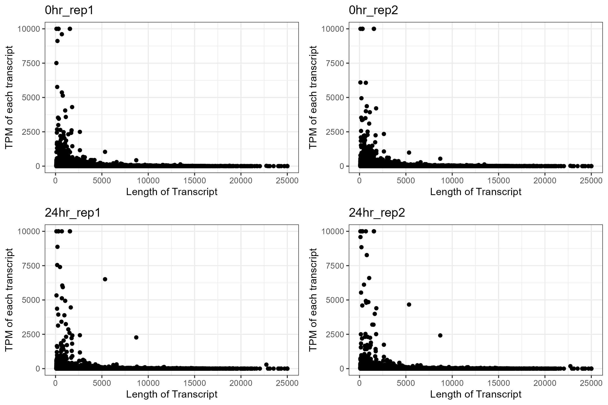

# RNA sequencing preprocessing
> Preprocessing of RNA-sequencing including the quantification of transcriptome.

* [Package version](#package-version)
* [Transcriptome quantification](#transcriptome-quantification)
    + [Result](#result)
* [Reference](#reference)

## Package version
`salmon v1.8.0`
`hisat2 v2.2.1`

## Transcriptome quantification

### Command
The study used salmon as transcriptome quantifier. The mapping rate were below 60% which is quite low compared to expectation. However, the GC content does shows a potential appearance of contamination so we will need to verify this, hence, running hisat2. 

```sh
# salmon quantification
salmon quant -i $index -l A -1 $R1 -2 $R2 -p 8 --validateMappings --gcBias --seqBias --recoverOrphans -o $output
```

In order to verify the unknown source, a second alignment were performed using hisat2. The result from hisat2 will be aligned against the genome index in which allows us to verify whether the results may be yielded from a human source as all transcipt are the results from DNA.

```sh
# trimming
trim_galore --paired --output_dir $trim_dir $R1 $R2
# hisat2 alignment
hisat2 -p 8 -1 $R1 -2 $R2 -S ./Output.sam
```

### Result

The mapping of results using salmon shows to present an alignment rate ranging between 50% to 60% (Plot1A). The component of read pairs included in the results are shown in Plot1B. 

According to the theory of RNA-seq, a long transcripts should have more RNA-seq library reads after the fragmentation of the reads. However, there is also studies that suggest that long transcript are generally lowly expressed due to reservation of energy. Therefor, we plotted Plot1C to see the distribution of the TPM versis the length of transcripts.

<br />
<p align="center">
  
</p>

<br />
<p align="center">
  
</p>

<br />
<p align="center">
  
</p>

## Reference
