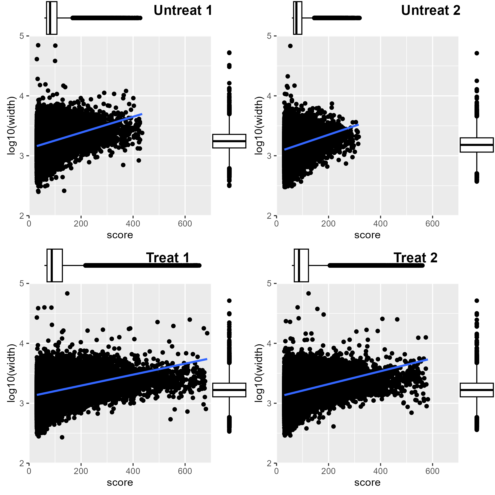
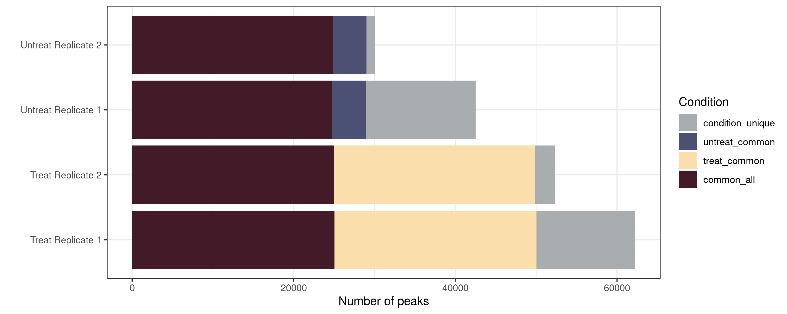

# ATAC sequencing preprocessing
> Preprocessing of ATAC-seq library includes the alignment, filtering, deduplication and peak calling.

* [Package version](#package-version)
* [Library trimming](#library-trimming)
    + [Command](#command)
* [Alignment](#alignment)
    + [Command](#command)
* [Post-alignment filtering](#post-alignment-filtering)
    + [Command](#command)
    + [Result](#result)
* [Peak calling](#peak-calling)
    + [Command](#command)
    + [Result](#result)
* [Reference](#reference)

## Package version
`trim_galore v0.6.7`
`cutadapt v4.1`
`bowtie2 v2.4.5`
`samtools v1.15.1`
`picard v2.27.0`
`Genrich v0.6.1`
`HMMRATAC v1.2.10`


## Library trimming

### Command

The trimming were performed to remove adapter and random hexamers added during sequencing. Majority of the ATAC-seq reads are around 70bp as an accessible region between nucleosomes as around 75bp. So by trimming we can remove the low quality, random hexamers added in for short fragments and also adpater sequences.

```sh
# ATAC-seq library trimming
trim_galore --paired --output_dir $trim_dir $R1 $R2
```

## Alignment

The alignment has shown to presence an high alignment rate throughout.

### Command

```sh
# ATAC-seq alignment
bowtie2 --very-sensitive --end-to-end -p 8 --dovetail --no-mixed -X 2000 -t -x $Index -1 $Read1 -2 $Read2 > ${prefix}.bowtie2.log | samtools sort -@ 4 -O bam -o ${prefix}.bam
```

## Post-alignment filtering

ATAC-seq is heavily contaminated with chrM reads.

| Sequence Condition | Untreat replicate 1 | Untreat replicate 2 | Treat replicate 1 | Treat replicate 2 |
| ------------------ | ------------------: | ------------------: | ----------------: | ----------------: |
| Trimmed |2131986 | 1213506 | 1461609 | 1112000 |
| Unmapped | 5514273 | 2676519 | 3864110 | 2918540 |
| chrM | 96892073 | 74408345 | 85416880 | 65415929 |
| Duplicate | 9948437 | 7205599 | 9000845 | 6873286 |
| Quality | 2802143 | 2334908 | 4919608 | 3376020 |
| Remaining | 16934225 | 13657260 | 23487928 | 21860928 |
| __Total__ | __134223137__ | __101496137__ | __128150980__ | __101556703__ |

### Command 

```sh
# Removing mitochondrial reads
samtools view -@ 4 -h ${prefix}.bam | grep -v chrM | samtools sort -@ 4 -O bam -o ${prefix}.rmChrM.bam

# Deduplication
picard MarkDuplicates Input=${prefix}.rmChrM.bam Output=${prefix}.rmChrM_dedup.bam METRICS_FILE=${prefix}.dedup.txt REMOVE_DUPLICATES=true VALIDATION_STRINGENCY=LENIENT

# Remove unmapped, low quality, unpaired reads
samtools view -h -b -q 30 -@ 4 -F 1804 -f 2 -o ${prefix}.final.bam ${prefix}.rmChrM_dedup.bam
# Creating the index for the file
samtools index ${prefix}.final.bam
```

### Result

<br />
<p align="center">
  
</p>

_**Plot2A. High number of mitochondrial contamination detected in ATAC-seq library.** Library reads were removed due to several different constraints._


## Peak calling

Currently, there is two package designed for ATAC-seq peak calling which is Genrich and HMMRATAC. In this study, we ran both. HMMRATAC provide us with a gappedPeak format which allows the whole accessible regions to be determined (peaks can be upto 10kbs long due to continuos open chromatin regions). Genrich provides a narrowPeak format providing only the few hundred bp of highly accessible regions.

### Command

```sh
# HMMRATAC peak calling
HMMRATAC -b ${prefix}.final.bam \
         -i ${prefix}.final.bam.bai \
         -g $GenomeFasta -o ${prefix}.hmmratac \ 
         -e $blacklist \ 
         -m $readlength,200,400,600 \
         --window 5000000 # remove RAM issue

# Genrich peak calling

```

### Result

In comparison of the 

<br />
<p align="center">
  
</p>

<br />
<p align="center">
  
</p>


## Reference

All command employed in this section can be found in [this script](../Script/2.%20ATAC%20preprocessing.sh)

All plots in this section were created using [this script](../Script/2.%20Plotting.R)
