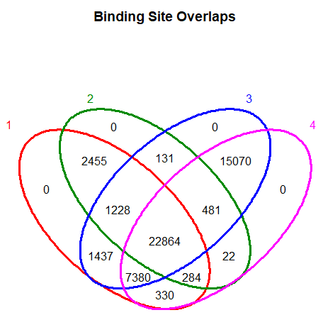
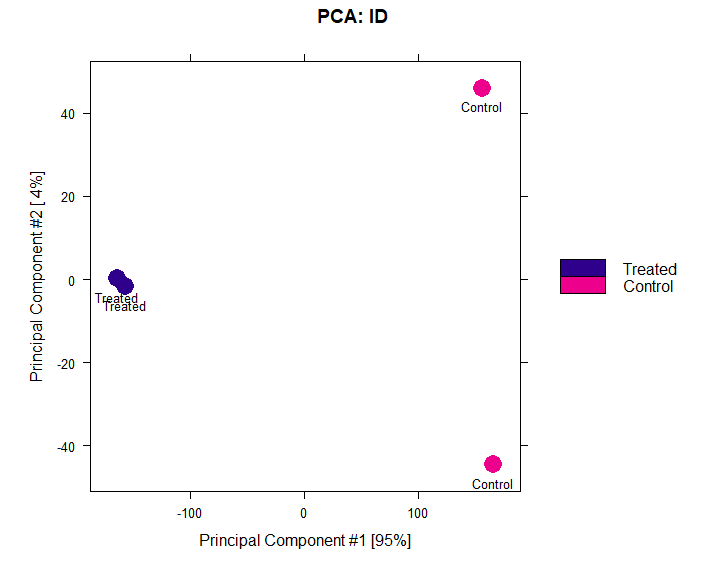
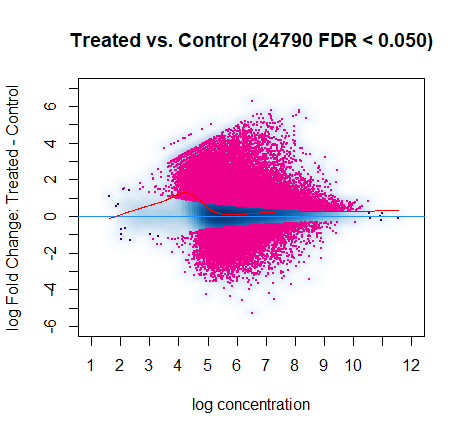
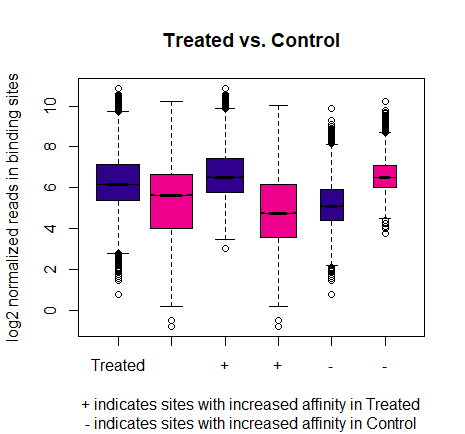
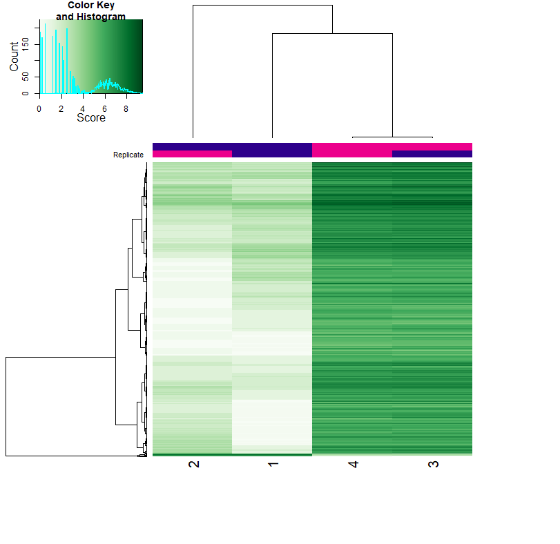
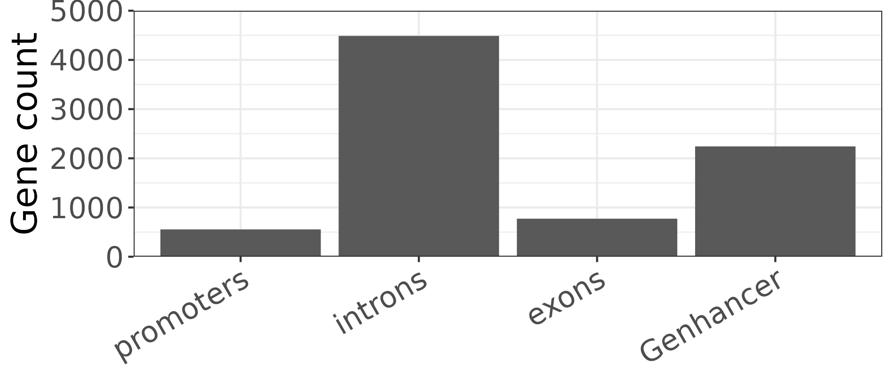
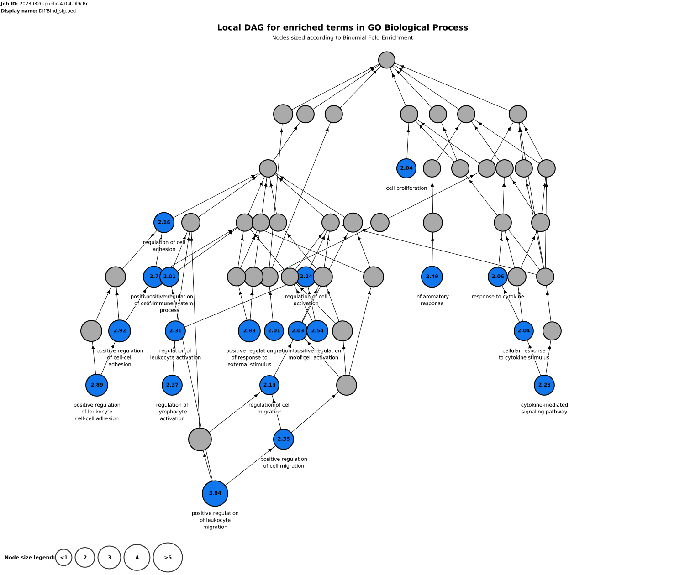
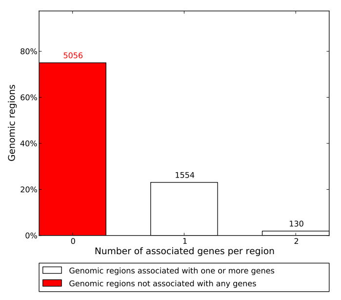
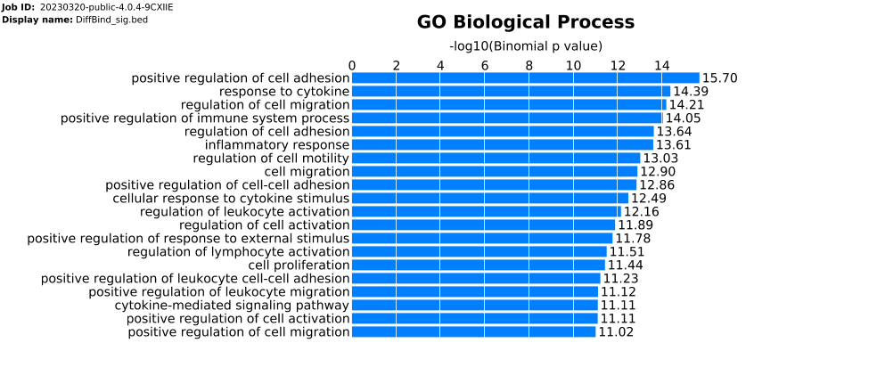
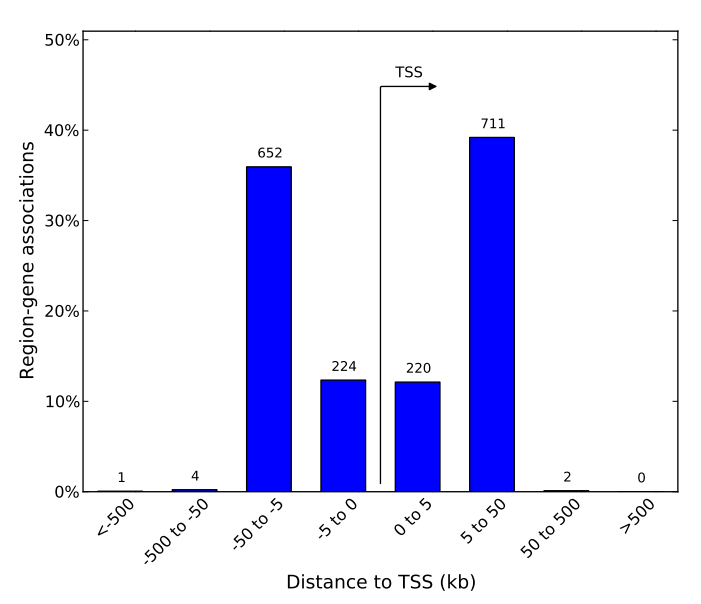

# Differential accessibility analysis
>  

* [Package version](#package-version)
* [Differential accessibility](#differential-accessibility)
    + [Command](#command)
    + [Result](#result)
* [Reference](#reference)

## Package version
`DESeq2 v1.34.0`
`tidyverse v1.3.1`
`DiffBind v3.6.5`

## Differential accessibility

### Command

```R
library(DiffBind)
library(tidyverse)

# Putting in the metadata
sampleTbl = data.frame(sampleID = c('control1','control2','treated1','treated2'),
                       Cell = 'THP1',
                       Factor = 'PMA',
                       Condition= c('Control','Control','Treated','Treated'),
                       Replicate = c("1","2","1","2"),
                       bamReads = c('../Input/bam/untreat_rep1.rmChrM.dedup.filter.bam',
                                    '../Input/bam/untreat_rep2.rmChrM.dedup.filter.bam',
                                    '../Input/bam/treat_rep1.rmChrM.dedup.filter.bam',
                                    '../Input/bam/treat_rep2.rmChrM.dedup.filter.bam'),
                       Peaks = c('../Input/HMM_removeHC/untreat_rep1.gappedPeak',
                                 '../Input/HMM_removeHC/untreat_rep2.gappedPeak',
                                 '../Input/HMM_removeHC/treat_rep1.gappedPeak',
                                 '../Input/HMM_removeHC/treat_rep2.gappedPeak'),
                       #bAll
                       ScoreCol = 13,
                       LowerBetter = FALSE
)

# Importing the data
ATAC <- dba(sampleSheet=sampleTbl)

# Perform count on each peak using the BAM file
ATAC_count <- dba.count(ATAC,minOverlap = 2,score = DBA_SCORE_NORMALIZED,bUseSummarizeOverlaps = TRUE)

# Differential accessibility analysis
ATAC_contrast <- dba.contrast(ATAC_count, categories=DBA_CONDITION,minMembers = 2)
ATAC_analyze <- dba.analyze(ATAC_contrast,method = DBA_ALL_METHODS)
ATAC_report <- dba.report(DBA = ATAC_analyze,DataType = DBA_DATA_FRAME,method = DBA_DESEQ2,contrast = 1,
                        th = 1)
Diff.bind.sig = ATAC_report %>% dplyr::filter(abs(Fold) > 2 & FDR < 0.01)
```


### Result

We looked at the number of overlap peaks between the replicates

<br />
<p align="center">
  
</p>

<br />
<p align="center">
  
</p>

<br />
<p align="center">
  
</p>

<br />
<p align="center">
  
</p>

<br />
<p align="center">
  
</p>

<br />
<p align="center">
  
</p>

<br />
<p align="center">
  
</p>

<br />
<p align="center">
  
</p>

<br />
<p align="center">
  
</p>

<br />
<p align="center">
  
</p>

<br />
<p align="center">
  
</p>


## Reference


