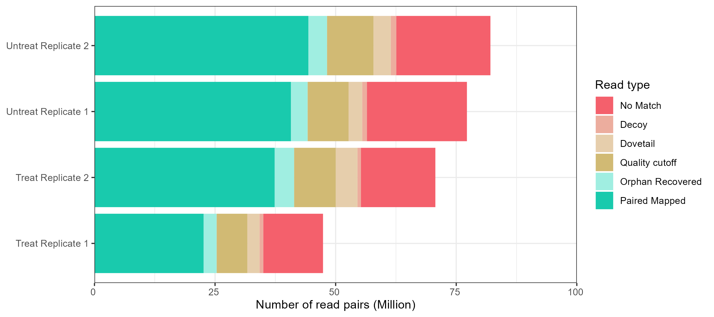
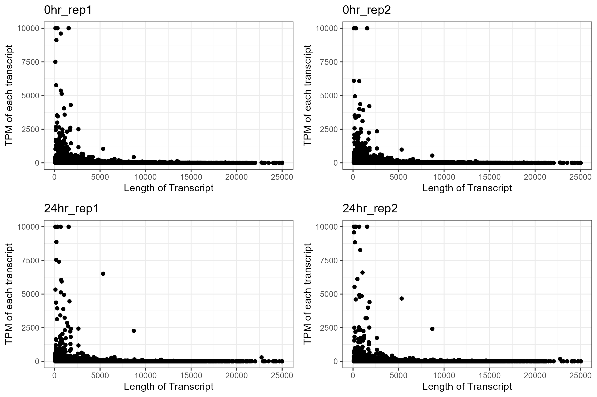

# Transcriptome analysis
> Repo containing details of transcriptome analysis

* [Package version](#package-version)
* [Transcriptome quantification](#transcriptome-quantification)
    + [Result](#result)
* [Differential expression](#differential-expression)
    + [Command](#command)
    + [Result](#result)
* [Enrichment analysis](#enrichment-analysis)
    + [Command](#command)
    + [Result](#result)    
* [Reference](#reference)

## Package version
`salmon v1.8.0`
`DESeq2 v1.34.0`
`tximport v1.22.0`
`biomaRt v2.50.3`
`tidyverse v1.3.1`

## Transcriptome quantification

Salmon were selected as the aligner for this study

> Conducted in terminal 

### Command

```sh
# Generating partial decoy for salmon
generateDecoyTranscriptome.sh -a $gtffile -o ${dir} -j 8 -g ${genome.fa} -t ${transcript.fa} 
# Creating salmon index
salmon index -t ${transcripts.fa} -i $transcripts_index --decoys ${decoys.txt} -k 31
```

```sh
# salmon quantification
salmon quant -i $index -l A -1 $R1 -2 $R2 -p 8 --validateMappings --gcBias --seqBias --recoverOrphans -o $output
```

### Result

The mapping of results using Salmon ranges between 50% and 60% (Plot 1A). We noticed that many reads were removed due to quality issues or were not recorded within the index. In section 0, we suggested a low likelihood of foreign contamination. Therefore, considering these results together, we believe that the contamination we are observing here is possibly DNA or ncRNA not recorded in the index. This is a possible outcome of rRNA depletion, the method used for RNA extraction, so there isn't strong evidence to worry about quality issues for the RNA sequencing alignment result.

<br />
<p align="center">
  
</p>

_**Plot1A. Alignment rate and component of RNA-seq library.** The alignment rate of each sample varies between 50% to 60%. Paired Mapped reads and Orphan Recovered reads are considered as usable reads (The two green)._

<br />

According to the theory of RNA-seq, long transcripts should have more RNA-seq library reads after read fragmentation. However, there are also studies that suggest that long transcripts are generally expressed at a low level due to the conservation of energy. Therefore, we plotted Plot1C to examine the distribution of TPM versus transcript length. We found that the overall distribution appears highly similar.

<br />
<p align="center">
  
</p>

_**Plot1B. TPM versus transcript length.**_

## Differential expression
> Conducted in R studio

Using DESeq2 to compare the change in gene expression due to PMA treatment.

### Command
Importing all transcriptome quantification from salmon into a gene-level quanitification with a dataframe format as input for DEseq2.

```R
library("tximport")

# Listing the path to each file.
files <- c('../Input/0hr_rep1/quant.sf',
           '../Input/0hr_rep2/quant.sf',
           '../Input/24hr_rep1/quant.sf',
           '../Input/24hr_rep2/quant.sf')
          
# Covert tx into gene          
txi.salmon <- tximport(files = files,
                       type = "salmon",
                       txOut = FALSE,
                       tx2gene = tx2gene,
                       ignoreAfterBar = TRUE)
                      
# Providing condition name to each replicates
sampleTable <- data.frame(condition = factor(rep(c("control", "treated"),each = 2)))
rownames(sampleTable) <- colnames(txi.salmon$counts)  
```

Running DESeq2 for differential expression detection.

```R
library("DESeq2")
library("IHW")

# Importing the result from tximport to DESeq2
dds <- DESeqDataSetFromTximport(countData = txi.salmon,
                                colData = sampleTable,
                                design = ~ condition) 

# Perform Differential expression analysis using Wald test
dds <- DESeq(object = dds,
             test = 'Wald')

# Performing l2FC shrinkage to remove bias.
result <- lfcShrink(dds = dds,
                    coef = "condition_treated_vs_control",
                    type="apeglm")
```

At this point, we will be done with DESeq2. Now it to make it easier for intepretation

```R
gene_annot <- function(result = result,dds = dds,gtf_file) {
  
  # Creating a ID to symbol conversion table
  gtf_file <- rtracklayer::import(gtf_file)
  gtf_file <- as.data.frame(gtf_file)
  gtf_file <- unique(gtf_file[,c("gene_id","gene_name")])
  
  # Putting all important information into a single object
  res <- merge(as.data.frame(result),
               as.data.frame(counts(dds,normalized=TRUE)),
               by = "row.names",
               sort = FALSE)
  # Putting the gene symbol with the gene id
  res <- merge(x = res,
               y = gtf_file,
               by.x = "Row.names",
               by.y = "gene_id")
  
  # Getting gene stable version number
  res$Row.names <- gsub("(ENSG[0-9]+)\\.[0-9]+", "\\1",res$Row.names) 
 
  return(res)
}

resdata = gene_annot(result = result,dds = dds,gtf_file = "../support_doc/Gencode/gencode.v40.annotation.gtf.gz")


```

Now adding in cutoff values to determine the final results

```R
resdata = resdata[resdata$baseMean > 20,]
sig = resdata[resdata$padj < 0.05 & abs(resdata$log2FoldChange) > 2,]
```

### Result

<br />
<p align="center">
  
</p>

To shows the number of differential expressed genes and the distribution, we will be plotting a volcanoi lot for DEGs to show there parameters. 

<br />
<p align="center">
  
</p>

<br />
<p align="center">
  
</p>

_**Figure 3.2. Volcano Plot.** _


## Enrichment analysis

Ads now we have a bunch of DEGs, we will like to obtain the biological meaning of these DEGs through running enrichment analysis. But kegg pathways shows a limited of understanding on the impact so we will only be focusing on Gene ontology of the genes.

### Command

```R
library("clusterProfiler")
library("org.Hs.eg.db")

ORA_GO = function(background,sig_gene,term = 'ALL') {
  # Setting the universal genes
  BG = as.character(background$Row.names)
  # Creating the genelist for ORA
  genelist = sig_gene$log2FoldChange
  names(genelist) = sig_gene$Row.names
  genelist = sort(genelist,decreasing = TRUE)
  gene = names(genelist)[abs(genelist) > 2]
  # Enrichment analysis using clusterProfiler
  res <- enrichGO(gene = gene, 
                  universe = BG,
                  OrgDb = 'org.Hs.eg.db',
                  ont = term,
                  keyType = 'ENSEMBL',
                  pAdjustMethod = "BH",
                  pvalueCutoff = 0.01,
                  readable = TRUE)
  return(res)
}

ORA = ORA_GO(background = resdata,sig_gene = sig,term = "ALL")
```

### Result

<br />
<p align="center">
  
</p>


## Reference

